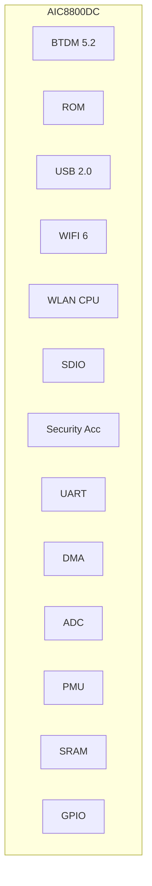

# AICSEMI AIC8800DC

The AIC8800DC is a highly integrated single-chip solution featuring 2.4GHz Wi-Fi 6 and Bluetooth 5.2. It is designed for wireless and IoT applications, offering a compact 4mm x 4mm QFN36 package.
Key Specifications
## Wi-Fi 6 Features

Protocol Support: Fully integrated RF, Modem, and MAC supporting 2.4GHz Wi-Fi 6.

Data Rates: Reaches up to 286.8 Mbps (TX) and 229.4 Mbps (RX) with 20/40MHz bandwidth.

Performance:

TX Power: Up to 20dBm in 11b mode; 18dBm in HT/VHT/HE40 MCS7 modes.

RX Sensitivity: -98dBm in 11b 1M mode.

Advanced Features: Supports MU-MIMO, OFDMA, TWT (Target Wake Time), STBC, beamforming, and LDPC.

Security: Comprehensive support including WPA3-SAE Personal, WPA2, WPA, WEP, and MFP.

Operating Modes: STA, AP, and Wi-Fi Direct modes can run concurrently.

## Bluetooth 5.2 Features

Compatibility: Supports all mandatory and optional features for Bluetooth 2.1+EDR, 3.0, 4.x, and 5.2.

Topologies: Supports advanced master and slave topologies.

Enhancements: Uses soft-bit cascading for gfsk header demodulation (3dB enhancement) and an optimized channel quality assessment for AFH enhancement.

## Platform & Interfaces

Host Interfaces: Supports USB 2.0, SDIO, HCI_UART, and PCM interfaces.

Integrated Components: Includes a WLAN CPU, security accelerator, DMA, PMU, and integrated RAM/ROM.

Other Tools: Features a low-power timer, watchdog, and 512-bit eFuse.

## Electrical & Physical

Voltage Supply (VBAT): Recommended 3.3V (range of 2.97V to 3.63V).

Ambient Temperature: Operates between -20°C and +80°C.

Packaging: Compact QFN36 package measuring 4mm x 4mm x 0.85mm.

 CMOS single‐chip fully‐integrated RF, Modemand MAC


 Support STA, AP, Wi‐Fi Direct modes concurrently
 Support STBC, beamforming
 Support Wi‐Fi6 TWT
 Support Two NAV, Buffer Report, Spatial reuse, Multi‐BSSID, intra‐PPDU power save
 Support LDPC
 SupportMU‐MIMO,OFDMA
 Support DCM, Mid‐amble, UORA
 Support WEP/WPA/WPA2/WPA3‐SAE Personal, MFP
1.2 BTDM5.2 Features   
 Supports allthemandatory and optionalfeatures of Bluetooth 2.1+EDR/3.0/4.x/5.2
 Supports advanced master and slave topologies
 Use soft‐bit cascading algorithm for demodulating gfsk header, 3db enhancement
 Use an optimization method to assess channel quality, AFH enhancement
1.3 Other Features
 Supports SDIO/USB2.0/HCI_UART/PCMinterface
 Integrated low powertimer and watchdog
 512 bits eFuse

Compact profile package：4mm×4mm×0.85mm QFN36

Applications:
 IoT device
 Wireless device

### Electrical Characteristics

**Table 3-1 DC Electrical Specification (Recommended Operation Conditions):**

| SYMBOL | DESCRIPTION | MIN | TYP | MAX | UNIT |
| :--- | :--- | :--- | :--- | :--- | :--- |
| VBAT | Supply Voltage from battery or LDO | 2.97 | 3.3 | 3.63 | V |
| Tamb | Ambient Temperature | -20 | 27 | +80 | ℃ |
| VIL | CMOS Low Level Input Voltage | 0 | | 0.3*VIO | V |
| VIH | CMOS High Level Input Voltage | 0.7*VIO | | VIO | V |
| VTH | CMOS Threshold Voltage | | 0.5*VIO | | V |

## 2. Platform Description

### Figure 2-1 AIC8800DC Block Diagram

