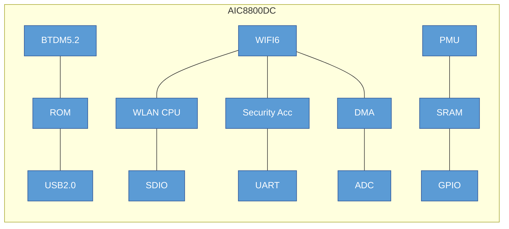

# AICSEMI AIC8800DC

The AIC8800DC is a highly integrated single-chip solution featuring 2.4GHz Wi-Fi 6 and Bluetooth 5.2. It is designed for wireless and IoT applications, offering a compact 4mm x 4mm QFN36 package.
Key Specifications
## Wi-Fi 6 Features

Protocol Support: Fully integrated RF, Modem, and MAC supporting 2.4GHz Wi-Fi 6.

Data Rates: Reaches up to 286.8 Mbps (TX) and 229.4 Mbps (RX) with 20/40MHz bandwidth.

Performance:

TX Power: Up to 20dBm in 11b mode; 18dBm in HT/VHT/HE40 MCS7 modes.

RX Sensitivity: -98dBm in 11b 1M mode.

Advanced Features: Supports MU-MIMO, OFDMA, TWT (Target Wake Time), STBC, beamforming, and LDPC.

Security: Comprehensive support including WPA3-SAE Personal, WPA2, WPA, WEP, and MFP.

Operating Modes: STA, AP, and Wi-Fi Direct modes can run concurrently.

## Bluetooth 5.2 Features

Compatibility: Supports all mandatory and optional features for Bluetooth 2.1+EDR, 3.0, 4.x, and 5.2.

Topologies: Supports advanced master and slave topologies.

Enhancements: Uses soft-bit cascading for gfsk header demodulation (3dB enhancement) and an optimized channel quality assessment for AFH enhancement.

## Platform & Interfaces

Host Interfaces: Supports USB 2.0, SDIO, HCI_UART, and PCM interfaces.

Integrated Components: Includes a WLAN CPU, security accelerator, DMA, PMU, and integrated RAM/ROM.

Other Tools: Features a low-power timer, watchdog, and 512-bit eFuse.

## Electrical & Physical

Voltage Supply (VBAT): Recommended 3.3V (range of 2.97V to 3.63V).

Ambient Temperature: Operates between -20°C and +80°C.

Packaging: Compact QFN36 package measuring 4mm x 4mm x 0.85mm.


 CMOS single‐chip fully‐integrated RF, Modemand MAC


 Support STA, AP, Wi‐Fi Direct modes concurrently
 Support STBC, beamforming
 Support Wi‐Fi6 TWT
 Support Two NAV, Buffer Report, Spatial reuse, Multi‐BSSID, intra‐PPDU power save
 Support LDPC
 SupportMU‐MIMO,OFDMA
 Support DCM, Mid‐amble, UORA
 Support WEP/WPA/WPA2/WPA3‐SAE Personal, MFP
1.2 BTDM5.2 Features   
 Supports allthemandatory and optionalfeatures of Bluetooth 2.1+EDR/3.0/4.x/5.2
 Supports advanced master and slave topologies
 Use soft‐bit cascading algorithm for demodulating gfsk header, 3db enhancement
 Use an optimization method to assess channel quality, AFH enhancement
1.3 Other Features
 Supports SDIO/USB2.0/HCI_UART/PCMinterface
 Integrated low powertimer and watchdog
 512 bits eFuse

Compact profile package：4mm×4mm×0.85mm QFN36

Applications:
 IoT device
 Wireless device

### Electrical Characteristics

**Table 3-1 DC Electrical Specification (Recommended Operation Conditions):**

| SYMBOL | DESCRIPTION | MIN | TYP | MAX | UNIT |
| :--- | :--- | :--- | :--- | :--- | :--- |
| VBAT | Supply Voltage from battery or LDO | 2.97 | 3.3 | 3.63 | V |
| Tamb | Ambient Temperature | -20 | 27 | +80 | ℃ |
| VIL | CMOS Low Level Input Voltage | 0 | | 0.3*VIO | V |
| VIH | CMOS High Level Input Voltage | 0.7*VIO | | VIO | V |
| VTH | CMOS Threshold Voltage | | 0.5*VIO | | V |


## 2. Platform Description

### Figure 2-1 AIC8800DC Block Diagram


```
graph TD
    subgraph Chip ["AIC8800DC (QFN36)"]
        direction TB

        %% Top Pins
        subgraph Top [" "]
            p36[36: RF_ANT] --- p35[35: PWRKEY] --- p34[34: GPIOA9] --- p33[33: VDD33_PA] --- p32[32: AVDD] --- p31[31: V_RF] --- p30[30: GPIOA8] --- p29[29: SW1] --- p28[28: SW2] --- p27[27: VDD33] --- p26[26: GPIOB2]
        end

        %% Middle Section (Left Pins | Die | Right Pins)
        subgraph Mid [" "]
            direction LR
            subgraph LeftPins [" "]
                direction TB
                p1[1: RF_IND]
                p2[2: GPIOA7]
                p3[3: GPIOA0]
                p4[4: GPIOA1]
                p5[5: GPIOA2]
                p6[6: GPIOA3]
                p7[7: GPIOA4]
            end

            Center[("EPAD / GND")]

            subgraph RightPins [" "]
                direction TB
                p25[25: V_CORE]
                p24[24: VIO]
                p23[23: GPIOA10]
                p22[22: GPIOA11]
                p21[21: GPIOA12]
                p20[20: GPIOA13]
                p19[19: GPIOA14]
            end
        end

        %% Bottom Pins
        subgraph Bottom [" "]
            p8[8: GPIOA5] --- p9[9: GPIOA6] --- p10[10: XTAL1] --- p11[11: XTAL2] --- p12[12: AVDD18] --- p13[13: GPIOB3] --- p14[14: GPIOB0] --- p15[15: GPIOB1] --- p16[16: USB_DM] --- p17[17: USB_DP] --- p18[18: GPIOA15]
        end

        Top --- Mid --- Bottom
    end

    %% Styling
    style Chip fill:#f9f9f9,stroke:#333,stroke-width:2px
    style Center fill:#ccc,stroke:#666,stroke-dasharray: 5 5
    style Top stroke:none,fill:none
    style Mid stroke:none,fill:none
    style Bottom stroke:none,fill:none
    
    %% Pin Styling
    classDef pin fill:#fff,stroke:#333,stroke-width:1px;
    class p1,p2,p3,p4,p5,p6,p7,p8,p9,p10,p11,p12,p13,p14,p15,p16,p17,p18,p19,p20,p21,p22,p23,p24,p25,p26,p27,p28,p29,p30,p31,p32,p33,p34,p35,p36 pin;
    
```
