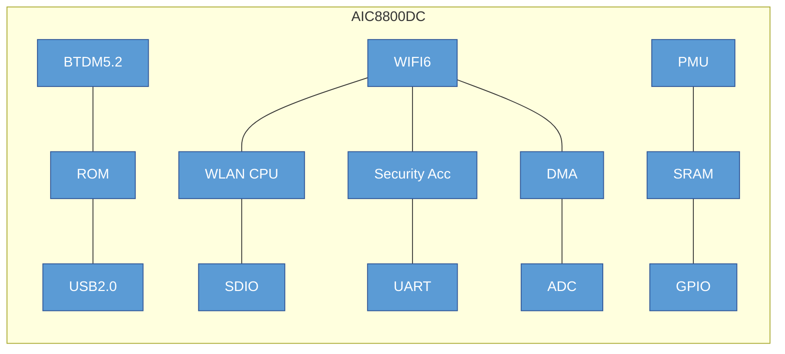

# AICSEMI AIC8800DC

The AIC8800DC is a highly integrated single-chip solution featuring 2.4GHz Wi-Fi 6 and Bluetooth 5.2. It is designed for wireless and IoT applications, offering a compact 4mm x 4mm QFN36 package.
Key Specifications
## Wi-Fi 6 Features

Protocol Support: Fully integrated RF, Modem, and MAC supporting 2.4GHz Wi-Fi 6.

Data Rates: Reaches up to 286.8 Mbps (TX) and 229.4 Mbps (RX) with 20/40MHz bandwidth.

Performance:

TX Power: Up to 20dBm in 11b mode; 18dBm in HT/VHT/HE40 MCS7 modes.

RX Sensitivity: -98dBm in 11b 1M mode.

Advanced Features: Supports MU-MIMO, OFDMA, TWT (Target Wake Time), STBC, beamforming, and LDPC.

Security: Comprehensive support including WPA3-SAE Personal, WPA2, WPA, WEP, and MFP.

Operating Modes: STA, AP, and Wi-Fi Direct modes can run concurrently.

## Bluetooth 5.2 Features

Compatibility: Supports all mandatory and optional features for Bluetooth 2.1+EDR, 3.0, 4.x, and 5.2.

Topologies: Supports advanced master and slave topologies.

Enhancements: Uses soft-bit cascading for gfsk header demodulation (3dB enhancement) and an optimized channel quality assessment for AFH enhancement.

## Platform & Interfaces

Host Interfaces: Supports USB 2.0, SDIO, HCI_UART, and PCM interfaces.

Integrated Components: Includes a WLAN CPU, security accelerator, DMA, PMU, and integrated RAM/ROM.

Other Tools: Features a low-power timer, watchdog, and 512-bit eFuse.

## Electrical & Physical

Voltage Supply (VBAT): Recommended 3.3V (range of 2.97V to 3.63V).

Ambient Temperature: Operates between -20°C and +80°C.

Packaging: Compact QFN36 package measuring 4mm x 4mm x 0.85mm.

 CMOS single‐chip fully‐integrated RF, Modemand MAC


 Support STA, AP, Wi‐Fi Direct modes concurrently
 Support STBC, beamforming
 Support Wi‐Fi6 TWT
 Support Two NAV, Buffer Report, Spatial reuse, Multi‐BSSID, intra‐PPDU power save
 Support LDPC
 SupportMU‐MIMO,OFDMA
 Support DCM, Mid‐amble, UORA
 Support WEP/WPA/WPA2/WPA3‐SAE Personal, MFP
1.2 BTDM5.2 Features   
 Supports allthemandatory and optionalfeatures of Bluetooth 2.1+EDR/3.0/4.x/5.2
 Supports advanced master and slave topologies
 Use soft‐bit cascading algorithm for demodulating gfsk header, 3db enhancement
 Use an optimization method to assess channel quality, AFH enhancement
1.3 Other Features
 Supports SDIO/USB2.0/HCI_UART/PCMinterface
 Integrated low powertimer and watchdog
 512 bits eFuse

Compact profile package：4mm×4mm×0.85mm QFN36

Applications:
 IoT device
 Wireless device

### Electrical Characteristics

**Table 3-1 DC Electrical Specification (Recommended Operation Conditions):**

| SYMBOL | DESCRIPTION | MIN | TYP | MAX | UNIT |
| :--- | :--- | :--- | :--- | :--- | :--- |
| VBAT | Supply Voltage from battery or LDO | 2.97 | 3.3 | 3.63 | V |
| Tamb | Ambient Temperature | -20 | 27 | +80 | ℃ |
| VIL | CMOS Low Level Input Voltage | 0 | | 0.3*VIO | V |
| VIH | CMOS High Level Input Voltage | 0.7*VIO | | VIO | V |
| VTH | CMOS Threshold Voltage | | 0.5*VIO | | V |

## 2. Platform Description

### Figure 2-1 AIC8800DC Block Diagram

## 4. PINS Description

### Table 4-1 AIC8800DC Pins Description

| PIN NAME | QFN NO. | I/O | DESCRIPTION |
| :--- | :--- | :--- | :--- |
| **RF** | | | |
| RF_ANT | 36 | I/O | RF 2.4G, Connect to the output matching network. Support BT combo. |
| RF_IND | 1 | | RF ground, Connect to the output a 1.2nH inductor to ground. |
| **PMU** | | | |
| PWRKEY | 35 | I | Power Key, high level effective, Internal 200K pull-down resistance to ground. |
| V_RF | 30 | I | RF Circuit Supply Voltage. Bypass with a capacitor as close to the pin as possible. |
| SW1 | 29 | O | Connect to Pin 28. |
| VDD33 | 27 | I | System Circuit Supply Voltage. Bypass with a capacitor as close to the pin as possible. |
| AVDD | 32 | I | 1.3V Voltage. Bypass with a Capacitor to GND. |
| VDD33_PA | 33 | I | RF PA Voltage Input. Bypass with a capacitor as close to the pin as possible. |
| AVDD18 | 12 | O | 1.8V Voltage Output. Bypass with a capacitor as close to the pin as possible. |
| VIO | 24 | I | IO Power Supply. Bypass with a capacitor as close to the pin as possible. |
| SW2 | 28 | O | Switch node of the regulator. Connect to the output a 10uH inductor. |
| V_CORE | 25 | I | 0.9V Voltage Input. Digital Core Circuit Supply Voltage. |
| **CLK** | | | |
| XTAL1 | 10 | I | Internal/External Oscillator Input. |
| XTAL2 | 11 | O | Internal Oscillator Output. |
| **GPIO** | | | |
| GPIOA0 | 3 | I/O | General-purpose Input/Output |
| GPIOA1 | 4 | I/O | General-purpose Input/Output |
| GPIOA2 | 5 | I/O | General-purpose Input/Output |
| GPIOA3 | 6 | I/O | General-purpose Input/Output |
| GPIOA4 | 7 | I/O | General-purpose Input/Output |
| GPIOA5 | 8 | I/O | General-purpose Input/Output |
| GPIOA6 | 9 | I/O | General-purpose Input/Output |
| GPIOA7 | 2 | I/O | General-purpose Input/Output |
| GPIOA8 | 30 | I/O | General-purpose Input/Output |
| GPIOA9 | 34 | I/O | General-purpose Input/Output |
| GPIOA10 | 23 | I/O | General-purpose Input/Output |
| GPIOA11 | 22 | I/O | General-purpose Input/Output |
| GPIOA12 | 21 | I/O | General-purpose Input/Output |
| GPIOA13 | 20 | I/O | General-purpose Input/Output |
| GPIOA14 | 19 | I/O | General-purpose Input/Output |
| GPIOA15 | 18 | I/O | General-purpose Input/Output |
| GPIOB0 | 14 | I/O | General-purpose Input/Output |
| GPIOB1 | 15 | I/O | General-purpose Input/Output |
| GPIOB2 | 26 | I/O | General-purpose Input/Output |
| GPIOB3 | 13 | I/O | General-purpose Input/Output |
| USB_DM | 16 | I/O | D+ Pin of the USB cable |
| USB_DP | 17 | I/O | D- Pin of the USB cable |
